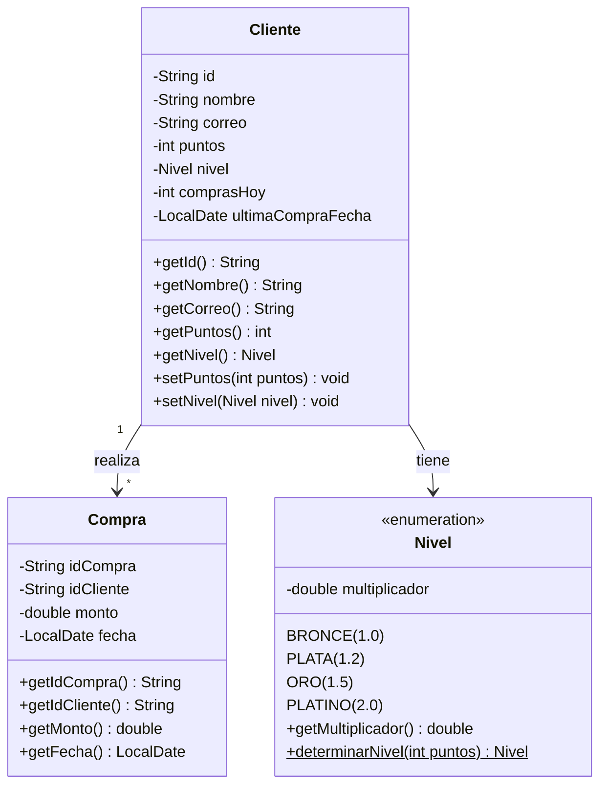

# Sistema de Fidelidad Gamificada

Programa de gestión de fidelización para tiendas de conveniencia con acumulación de puntos, niveles y bonificaciones.

## Diseño del Sistema

- **Arquitectura**: 3-capas (Modelo-Repositorio-Servicio)
- **Patrones**: Inyección de Dependencias, Singleton implícito
- **Flujo de compra**:
  1. Validar cliente
  2. Calcular puntos base (monto/100)
  3. Aplicar multiplicador de nivel
  4. Verificar bonus de 3 compras/día
  5. Actualizar estado del cliente
  6. Registrar compra

## Diagrama UML





## Instrucciones de Uso

### Compilación
```bash
mvn clean install
```

### Ejecución
```bash
mvn exec:java -Dexec.mainClass="com.fidelidad.MainApp"
```

### Pruebas Unitarias
```bash
mvn test
```

### Generación de Reporte de Cobertura
```bash
mvn jacoco:report
```
El reporte se generará en: `target/site/jacoco/index.html`

## Ejemplo de Salida de Tests
```
[INFO] Tests run: 12, Failures: 0, Errors: 0, Skipped: 0
[INFO] 
[INFO] Results:
[INFO] 
[INFO] Tests run: 12, Failures: 0, Errors: 0, Skipped: 0
```

## Cobertura de Código

**Herramienta**: JaCoCo  
**Tipo de cobertura**: 
- Líneas de código ejecutadas
- Ramas condicionales
- Complejidad ciclomática

**Razón de elección**:
- Integración nativa con Maven
- Genera reportes HTML interactivos
- Métricas estándar en el ecosistema Java
- Fácil configuración mediante pom.xml

## Notas Técnicas

### Metodología TDD
Se aplicó Desarrollo Guiado por Pruebas en componentes críticos:
- Cálculo de puntos
- Determinación de niveles
- Validación de correos electrónicos

### Validaciones
- Reglas de negocio implementadas en la capa de servicio
- Validación de formatos (email, montos positivos, fechas válidas)

### Extensibilidad
- Diseñado para fácil migración a base de datos
- Patrón Repository permite cambiar implementación de persistencia
- Jerarquía de niveles implementada como enum extensible

### Consideraciones
- Persistencia actual en memoria (no persistente entre ejecuciones)
- El bonus por compras consecutivas aplica solo para compras el mismo día
- Los niveles se recalculan automáticamente tras cada compra

**Sobre la Cobertura de Código**

Para medir la calidad de las pruebas implementadas, utilice JaCoCo como herramienta de análisis. Esta herramienta me permitió verificar dos aspectos clave:

-Cobertura de líneas:Mide qué porcentaje del código fuente fue ejecutado durante las pruebas. En mi caso, me enfoqué en asegurar que los componentes centrales como el cálculo de puntos y la gestión de niveles tuvieran una cobertura completa.

-Cobertura de ramas:Evalúa si todas las posibles decisiones lógicas (como las condiciones if/else o switch) fueron probadas. Esto fue especialmente importante para probar todos los casos de cambio de nivel (Bronce, Plata, Oro, Platino).

Opté por JaCoCo porque es la solución más utilizada en proyectos Java con Maven, y porque ofrece una integración directa con el ciclo de construcción. Los reportes generados me ayudaron a identificar rápidamente qué partes del código necesitaban más atención en las pruebas.

Para ver los resultados exactos, basta con ejecutar `mvn jacoco:report` y revisar el detalle en el archivo HTML generado en la carpeta target/site/jacoco/.

##  Licencia

Este proyecto está bajo la [Licencia MIT](LICENSE).

```text
MIT License

Copyright (c) 2025 Joaquin Lopez Diaz

Se concede permiso, libre de cargos, a cualquier persona que obtenga una copia
de este software y los archivos de documentación asociados (el "Software"), 
a utilizar el Software sin restricción, incluyendo sin limitación los derechos
de uso, copia, modificación, fusión, publicación, distribución, sublicencia 
y/o venta de copias del Software.
